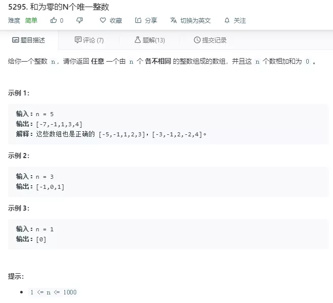
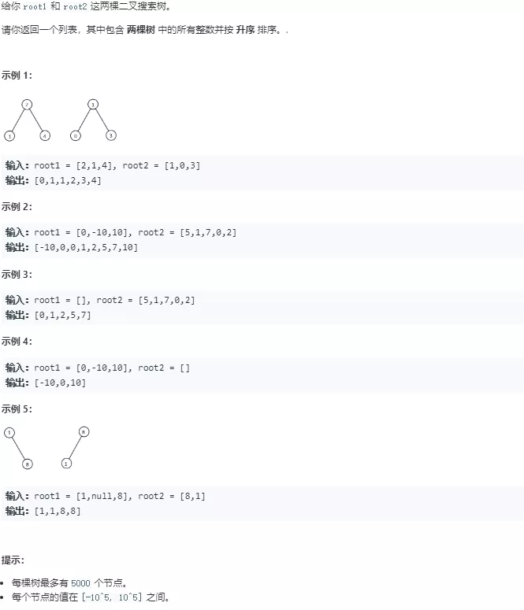
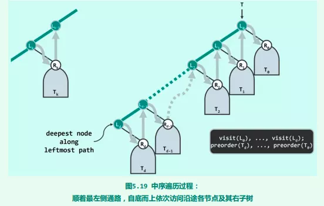
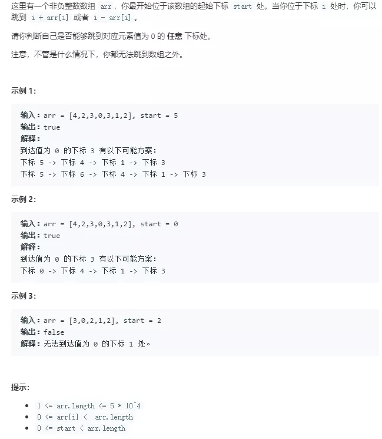
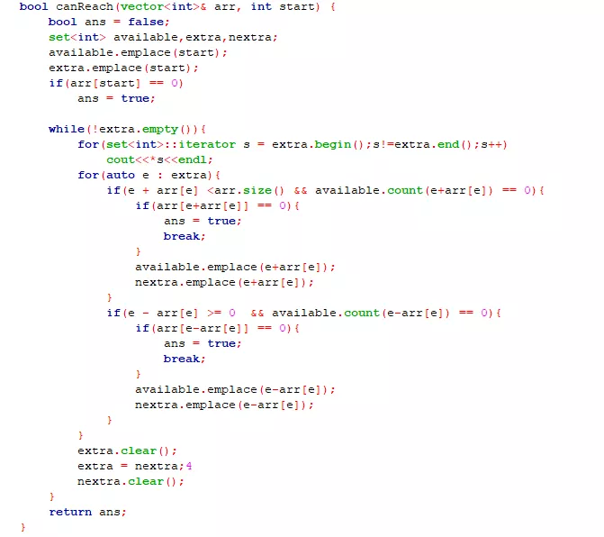
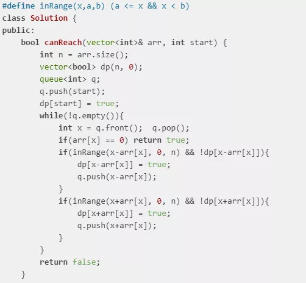
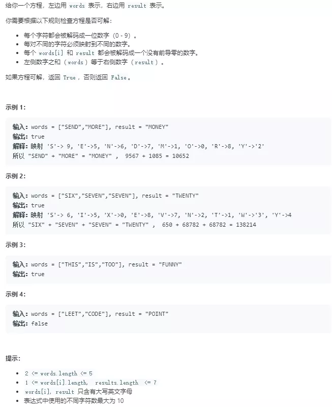
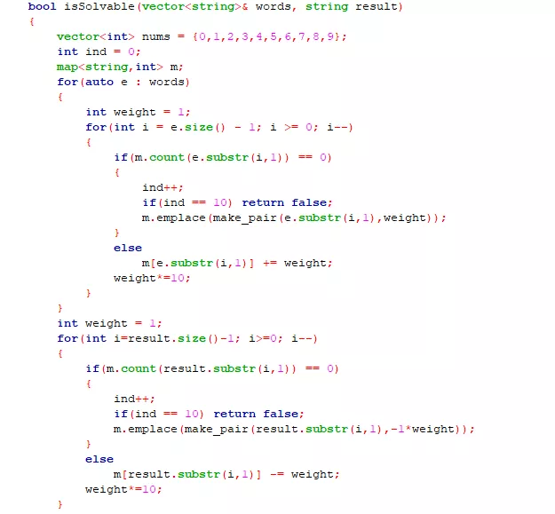
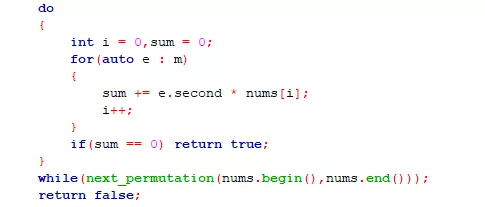

## 169周周赛分析

欢迎讨论~

本文有价值的地方在于周赛第四题的face4代码的解析

### 第一题



这一题很简单，但是比较有开放性，店长做法是

  如果n为偶数 那么生成-n/2,-n/2+1,...,-2,-1,1,2,.....,n/2

  如果n为奇数 那么就生成-n/2,-n/2+1,...-2,-1,0,1,2,.....,n/2


### 第二题



这一题比较基础，店长的思路是将两个树分别进行中序遍历，将遍历的结果分别存到两个数组中，然后再将这两个数组合并成有序数组，店长好久没刷题了，中序的写法给忘了，翻了书做的，用的是邓俊辉《数据结构》书上的中序代码(个人觉得这个代码非常的好)

```c++
stack<TreeNode*> s1;
while(true){
    if(root1){
        s1.emplace(root1);
        root1 = root1->left;
    }else if(!s1.empty()){
        root1 = s1.top();
        s1.pop();
        r1.emplace_back(root1->val);
        root1 = root1->right;
    }
    else
        break;
}
```

root1是树的根节点 s1是遍历过程中用的堆栈



算法思路是 将树看成上图的结构，中序遍历的输出顺序是L(d) R(d) L(d-1) R(d-1) ... L(1) R(1) L(0) R(0)的顺序 思路的核心在于以从L(0)为当前结点的中序遍历过程 与以R(d)为根的中序遍历过程是相似的

比赛前几名的方法 都是分别递归中序遍历root1 和 root2 遍历完输出到同一个数组中 然后对这个数组进行sort


### 第三题



店长的思路是 从start开始按照规则来找数组中所有可达位置，用一个set(available)来保存能到达的位置，用一个set(extra) 来保存一次遍历中新增的可达位置下面是店长的代码



while循环里面的for循环遍历extra,即每一个新增的所有位置

nextra保存的是这次循环新增的位置 循环最后赋值给extra
看了一下前几名的代码，发现我这个方法效率低，用队列或者是栈来保存新增的可达位置比较好，而且保存可到达位置的结构直接用数组就可以了，下面的是face4的代码 




### 第四题



店长的思路是把每个字母当做是一个变量，SEND就是1000*S+100*E+10*N+D 这个题就变成了一个解方程的题，把words和result解析成方程的系数存到数组中 然后用10的全排列中的前x位来作为解带入方程，结果超时了 即使不超时 我也没有将没有前导0的条件考虑进去，应该也是wrong answer 下面是店长的代码：



 weight表示每个位置的权值，比如SEND 遍历到D的时候weight为1 遍历到N的时候weight为10...

  ind 记录的是出现的所有字母 当字母个数>10时 方程肯定无解的 不能满足每个字符映射到不同数字这个条件

  m 里面存的是字母和该字母在方程中相应系数的映射

  nums 用于后面的全排列



取0-9的全排列中的前m.size()项 (这个代码while循环里面有明显的冗余，比如我要取全排列的前5项，0123456789的下一个排列是0123456798 前五项没有变化 要等到若干项以后 才会变化。效率低啊

学习学习前几名的代码，下面是face4的代码：

```c++

class Solution {
public:
    bool ng[26];
    int ten[8];
    int kiyo[26];
    vector<char> vc;
    bool ret = false;

    void dfs(int i, int used, int sum){
        if(i == vc.size()){
            ret |= sum==0;
            return;
        }
        for(int j = 0; j < 10; j++){
            if((used>>j)&1) continue;
            if(j == 0 && ng[vc[i]-'A']) continue;
            dfs(i+1, used|(1<<j), sum+j*kiyo[vc[i]-'A']);
        }
    }

    bool isSolvable(vector<string>& words, string result) {
        ten[0] = 1;
        for(int i = 1; i < 8; i++){
            ten[i] = ten[i-1]*10;
        }
        words.push_back(result);
        int n = words.size();
            // init
        for(int i = 0; i < 26; i++) ng[i] = kiyo[i] = 0;


        for(int i = 0; i < n; i++){
            for(int j = 0; j < words[i].length(); j++){
                vc.push_back(words[i][j]);
                kiyo[words[i][j]-'A'] += (i==n-1 ? -1 : 1) * ten[words[i].length()-1-j];
            }
            if(words[i].length() > 1)   ng[words[i][0]-'A'] = true;
        }
            sort(vc.begin(), vc.end());
            vc.erase(unique(vc.begin(),vc.end()), vc.end());
        dfs(0,0,0);
        return ret;
    }
};
```

ten里面存的是每个位的权值

ng存的是相应字母能否取0 如：ng['A'] == false 那么A 就不能为0

kiyo存的是每个字母所对应的系数

vc里面存的是所有出的字母

程序将result加入了words里面一起算系数(比如 SEND + MORE == MONEY 变为 SEND + MORE - MONEY == 0），所以在算系数的时候(i==n-1)的时候 要用减的而不是加的

当words[i].length() > 1时 words[i]就至少有一个字母 那么第一个字母就不能为0 所以设置相应的ng值 `ng[words[i][0]-'A'] = true;`

```c++
sort(vc.begin(), vc.end());
vc.erase(unique(vc.begin(),vc.end()), vc.end());
```

清除vc的多余项

由于题目条件中给了不同字符最大个数为10 所以代码没有对vc的个数进行限制(我眼瞎没看到这个条件）

dfs(i,used,sum)：

i 表示当前dfs正处理vc[i]的值

used 表示0--9中哪些值用过了 这里他使用位操作来记录用过的数，比如1用过了 那么used 为 1<<1

sum 表示vc[0]到vc[i-1]取完值后带入方程后的值

如 SEND + MORE - MONEY == 0

a*D + b*E + c*M + d*N + e*O + f*R + g*S + h*Y == 0

a,b,c,d,e,f,g,h为相应的系数 即存在kiyo里面的值

  vc:  D E  M    N O R S Y

  kiyo: 1 91 -9000 ... 

  ng['M']为false ng['S']为false

当i== 1时 假如循环到了j == 2 递归到下一个dfs的时候

  i==2 used == 4 sum == 2 (当前方程只取了D的值D的系数1乘上D的取值2）

   循环体的两个continue 分别对应的当前数字已被使用和不能为0的字母取了0

  当i == vc.size() 看sum是否为0 为0说明 dfs取的这组DEMNORSY的值是解